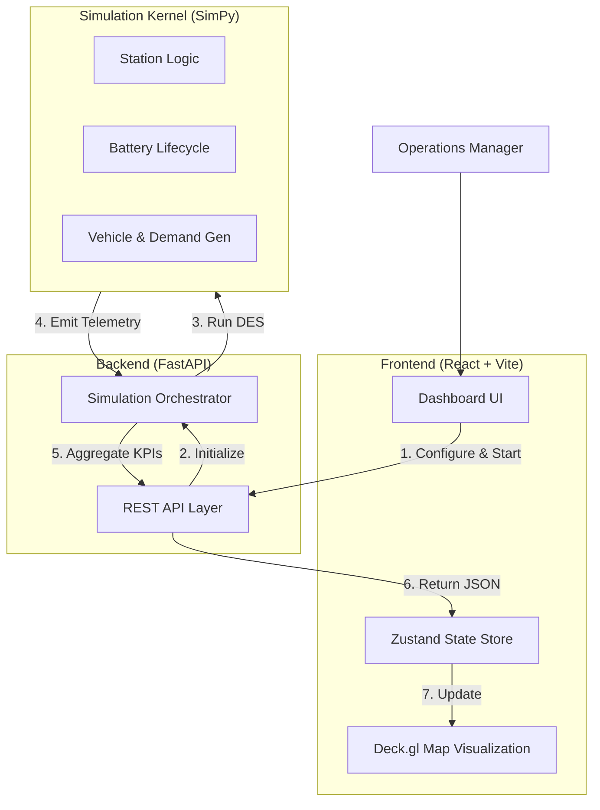
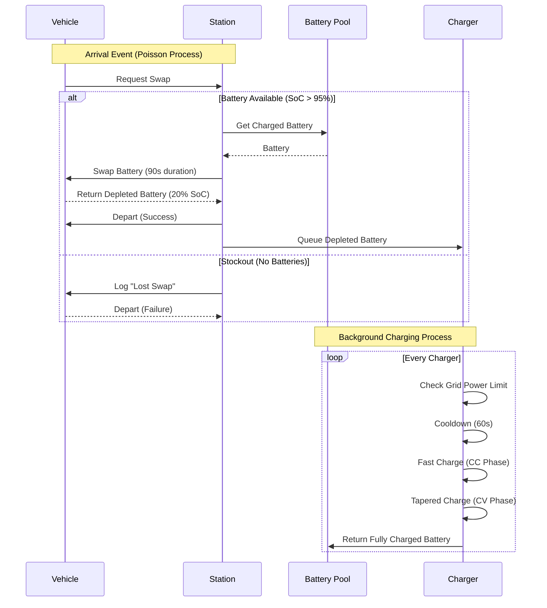

# Digital Twin Battery Swap Network Simulation


## 📖 Overview

The **Digital Twin Swap Station Simulation** is an enterprise-grade decision-support platform designed to model, analyze, and optimize city-wide battery swapping infrastructure.

By leveraging **Discrete Event Simulation (DES)**, this system creates a high-fidelity "Digital Twin" of your physical network. It allows operations managers and data scientists to execute counterfactual analysis ("what-if" scenarios) to minimize capital risk and maximize operational efficiency.

### Key Capabilities
*   **Stochastic Modeling:** Simulates non-homogeneous Poisson arrival processes to capture realistic demand fluctuations.
*   **Physics-Based Charging:** Models non-linear Li-ion charging curves (CC-CV), thermal cooling constraints, and grid power limits.
*   **A/B Scenario Testing:** Run parallel simulations to quantify the impact of adding stations, changing inventory, or upgrading hardware.
*   **Geospatial Visualization:** Interactive WebGL-powered dashboard for identifying bottlenecks and network hotspots.

---

## 🏗️ System Architecture

The application follows a modern decoupled architecture, separating the simulation kernel from the visualization layer.



---

## ⚙️ Simulation Logic Flow

The core engine models the complex interaction between vehicle demand and station resources. Below is the decision logic for a single vehicle arrival event.



---

## 🚀 Getting Started

### Prerequisites
*   **Python 3.11+** (for the simulation engine)
*   **Node.js 18+** (for the dashboard)

### 1. Backend Setup
The backend serves the API and runs the physics engine.

```bash
cd backend

# Create and activate virtual environment
python -m venv venv
# Windows:
venv\Scripts\activate
# Linux/Mac:
source venv/bin/activate

# Install dependencies
pip install -r requirements.txt

# Start the API server
uvicorn app.main:app --reload
```
*The API docs will be available at `http://127.0.0.1:8000/docs`*

### 2. Frontend Setup
The frontend provides the interactive map and control panel.

```bash
cd frontend-v2

# Install dependencies
npm install

# Start development server
npm run dev
```
*Access the dashboard at `http://localhost:5173`*

---

## 🧪 Simulation Features

### 1. Demand Modeling
*   **Curves:** Configure hourly demand profiles (e.g., Morning Peak, Evening Rush).
*   **Jitter:** Add stochastic variance to arrival times to simulate real-world unpredictability.

### 2. Station Physics
*   **Bays:** Limited queuing capacity (`G/G/k` queue).
*   **Grid Constraints:** Cap the maximum power draw per station (e.g., 200kW limit).
*   **Batteries:** Track individual battery health and cycle counts.

### 3. Analytics
*   **Wait Times:** Average and 95th percentile wait times.
*   **Lost Swaps:** Revenue lost due to stockouts.
*   **Utilization:** Charger uptime and asset efficiency.

---

## 📂 Repository Structure

| Directory | Description |
|-----------|-------------|
| `backend/app/simulation` | **Core Engine:** Contains `SimPy` logic, physics models, and orchestrator. |
| `backend/app/api` | **API Layer:** FastAPI routes for simulation control and reporting. |
| `backend/app/schemas` | **Data Models:** Pydantic schemas for configuration and results. |
| `frontend-v2/src/components` | **UI Components:** React components for Map, Sidebar, and Charts. |
| `frontend-v2/src/store` | **State Management:** Zustand store for application state. |

---

## 🤝 Contributing

We welcome contributions! Please follow these steps:
1.  Fork the repository.
2.  Create a feature branch (`git checkout -b feature/AmazingFeature`).
3.  Commit your changes (`git commit -m 'Add AmazingFeature'`).
4.  Push to the branch (`git push origin feature/AmazingFeature`).
5.  Open a Pull Request.

---

**Maintained by:** Hydra Engineering
**License:** MIT
